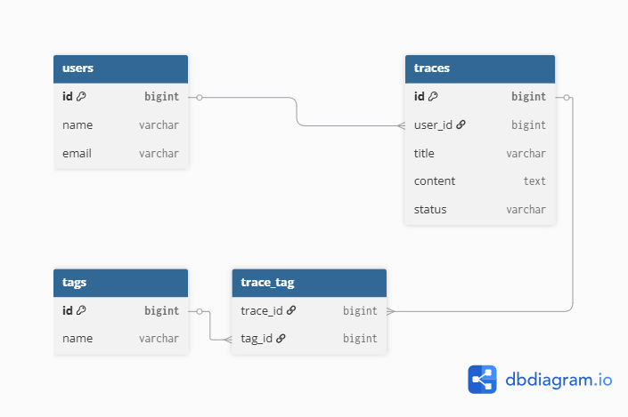

# TraceNote

## :bulb: Overview

新しい領域の学習において、理解の蓄積として管理することを目的とした学習支援アプリ。

単なるメモやノートではなく、

- 調査
- 理解
- 実践

といった学習状態を管理しながら、知識同士のつながりを意識して蓄積していくことを目的としています。

---

## :potted_plant: Feature

- ユーザー認証
- TraceのCRUD
- 学習状態管理
- Tagによる分類
- 検索機能
- Dashboard

---

## :gear: Tech Stack

- **T**ailwind CSS
- **A**lpine.js
- **L**ivewire
- **L**aravel 13

---

## :world_map: ER Diagram



## :memo: Memo

```
docs
├── 2026xxyy_er_diagram.png
├── screen_transition.png
├── dashboard_mock.png
└── wireframe.png
```

