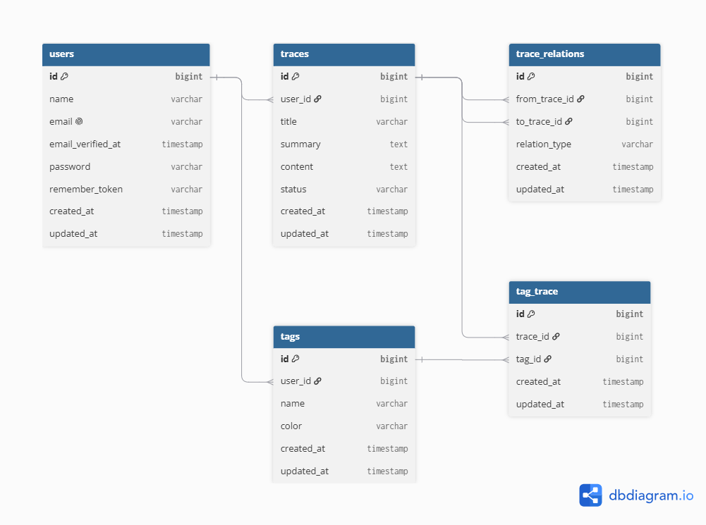

# TraceNote

:rocket: [Live Demo](https://tracenote.work)

## :bulb: Overview

新しい領域を学習する際に、学んだ知識を記録・整理し、蓄積していくための学習支援アプリです。

単なるメモやノートではなく、

- 調査
- 理解
- 実践

といった学習状態を管理しながら、知識同士のつながりを意識して蓄積していくことを目的としています。

---

## :potted_plant: Feature

- ユーザー認証
- TraceのCRUD
- 学習状態管理
- Tagによる分類
- TraceとTagの関連付け
- Trace同士の関連付け
- 検索機能
- Dashboard

---

## :gear: Tech Stack

### Application

- Laravel
- Livewire
- Tailwind CSS
- Alpine.js

### Infrastructure

- Nginx
- SQLite
- Ubuntu(VPS)

---

## :world_map: ER Diagram



## Documents

```bash
docs
├── deploy.md              # デプロイ関連
├── design_rule.md         # デザインルール
├── er_diagram.png         # ER図
├── trace_relation.md      # Traceモデルのリレーション
├── ui_components.md       # UI コンポーネント
```

